# singC 系统级模块架构

以下为当前源码的主要模块和进程边界，不是拟议重构方案。实线表示调用、控制或读写，虚线表示事件、快照或状态回传；为保持可读性，省略通用设置读取和 UI 属性通知等重复连线。

```mermaid
flowchart TB
    subgraph Desktop["singC.exe · WinUI 桌面主进程"]
        Shell["App / MainWindow<br/>启动、导航、退出协调"]
        subgraph UI["页面模块"]
            Home["HomePage / LogPage<br/>启动停止、模式切换、日志"]
            Monitor["ConnectionsPage / TrafficStatisticsPage<br/>连接列表与流量展示"]
            Settings["SettingsPage<br/>配置、规则、偏好与更新入口"]
            TestPage["NetworkTestPage<br/>诊断、稳定性测试与历史展示"]
        end
        subgraph Runtime["内核运行与配置"]
            CoreService["SingBoxService<br/>进程生命周期、配置校验、日志"]
            Mode["ProxyModeConfig<br/>生成 TUN / 代理运行配置"]
            Editor["SettingsViewModel / RouteConfigDocument<br/>规则编辑、配置保存与备份"]
            Proxy["SystemProxyLease / WindowsSystemProxy<br/>系统代理设置与恢复"]
            CheckRunner["ConfigCheckRunner<br/>校验进程、截止时间、有界输出"]
            ConfigStore["ConfigFileStore / ConfigLoadCoordinator<br/>原子配置写入、备份清理、过期读取保护"]
        end
        subgraph Observability["连接与统计"]
            Connections["ConnectionViewModel<br/>采集会话、列表刷新与筛选"]
            WS["ClashWebSocketService<br/>连接快照、累计字节与重连"]
            Traffic["TrafficStatisticsViewModel<br/>TrafficStatistics / OutboundTrafficStatistics<br/>总量与出站采样统计、持久化"]
            Snapshot["ClashApiEndpoint / ClashConnectionSnapshot<br/>运行端点、整帧校验、连接去重"]
            StatisticsStore["StatisticsFileStore<br/>独占写者、原子保存、损坏保护"]
        end
        Presentation["ConnectionPresentation / LogAnalysis<br/>纯筛选排序、日志分析"]
        SettingsStore["SettingsStore<br/>串行读改写、失败回滚、损坏提示"]
        Shutdown["ShutdownSequence<br/>停止、保存、清理顺序"]
        Handoff["BoundedResponse / UpdateHandoff<br/>有界元数据、可控交接等待"]
        Diagnostic["NetworkTestService<br/>HTTP / DNS / TCP / 控制接口 / 出口 IP"]
        Shared["AppSettings / BackgroundManager<br/>StartupManager / NativeFileDialog<br/>偏好、外观与平台辅助"]
        Update["AppUpdateService<br/>检查版本、下载、校验与更新协调"]
    end

    subgraph Kernel["sing-box.exe · 独立内核进程"]
        Engine["代理 / TUN 入站、路由与出站"]
        API["Clash API<br/>WebSocket /connections · HTTP /version"]
    end
    subgraph Installer["singC.Updater.exe · 独立更新进程"]
        Updater["Updater/Program + UpdateCore<br/>等待退出、安装事务、失败回滚、重启"]
    end
    OS["Windows<br/>系统代理、网络栈、权限与自启动"]
    Files[("本地文件<br/>用户配置与备份 / 临时运行配置<br/>settings.json / 流量统计 JSON<br/>代理恢复记录 / 更新暂存与备份")]
    Internet["目标网站 / DNS / 出口查询服务<br/>及内核配置的远端出站"]
    GitHub["GitHub Releases<br/>版本信息、发布包与校验文件"]
    Quota["可选流量服务<br/>用户配置的 HTTP 接口"]

    Shell --> Home
    Shell --> Monitor
    Shell --> Settings
    Shell --> TestPage
    Shell --> Shared
    Shell -->|初始化与退出协调| Connections
    Shell -->|退出停止| CoreService
    Shell --> Shutdown
    Shutdown -->|停止、保存与清理委托| CoreService
    Shutdown --> Connections
    Shell -->|自动检查| Update
    Home --> CoreService
    CoreService -.->|状态与日志| Home
    Home --> Traffic
    Monitor --> Connections
    Monitor --> Traffic
    Settings --> Editor
    Settings --> Shared
    Settings --> Update
    Editor -->|内核校验| CoreService
    Editor --> ConfigStore
    ConfigStore -->|配置与备份| Files
    CoreService --> Mode
    CoreService --> Proxy
    CoreService --> CheckRunner
    CheckRunner -->|check、输出与取消| Engine
    CoreService -->|启动 / 停止 / check| Engine
    CoreService -->|读取源配置、写运行配置| Files
    Engine -.->|标准输出、错误与退出| CoreService
    Proxy --> OS
    Proxy -->|恢复记录| Files
    Shared --> Files
    Shared --> SettingsStore
    SettingsStore --> Files
    Shared --> OS
    CoreService -.->|运行状态事件| Connections
    Connections -->|启动 / 停止采集| WS
    Connections -->|实际运行配置的端点与代次| CoreService
    WS --> Snapshot
    Connections --> Presentation
    Home --> Presentation
    WS -->|订阅 /connections| API
    WS -.->|连接快照| Connections
    WS -.->|总量与连接计数快照| Traffic
    Connections -->|统计会话与保存协调| Traffic
    Traffic --> StatisticsStore
    StatisticsStore --> Files
    TestPage --> Diagnostic
    TestPage -->|参数与历史保存| Shared
    TestPage -->|读取运行状态| CoreService
    Diagnostic -->|读取控制接口配置| Files
    Diagnostic -->|HTTP /version| API
    Diagnostic -->|HTTP / DNS / TCP 探测| Internet
    Engine --> OS
    Engine --> Internet
    Update --> GitHub
    Update --> Handoff
    Update -->|退出前保存与释放采集| Connections
    Update -->|校验与暂存更新包| Files
    Update -->|停止内核后交接| CoreService
    Update -->|启动更新助手、退出主程序| Updater
    Updater -->|替换 / 备份 / 回滚| Files
    Updater -->|重启并等待就绪标记| Shell
    Shell -->|FetchTrafficDataAsync| WS
    WS -->|可选 HTTP 查询| Quota

    classDef focus fill:#fff3cd,stroke:#986b00,stroke-width:2px,color:#202020;
    class Diagnostic focus;
```

架构阅读要点：

- 黄色节点标识网络诊断模块。网络诊断直接执行平台网络请求，HTTP 会受当前系统代理、TUN 和路由影响，不能将成功结果等同于“已走代理”；它不负责控制内核。
- 连接页与统计页共享采集链路。WebSocket 原始计数快照直接交给统计模块，连接列表的搜索、排序和刷新不作为统计输入。
- 采集端点和密钥来自内核当前运行配置；整帧最多 16 MiB，解析与去重后才分发。回调核对订阅代次及内核运行代次，停止时中止连接并限制等待。
- 两种统计算法保持独立，共用 `StatisticsFileStore`：以文件租约保证单一写者，第二实例只能读取磁盘历史；损坏文件禁止覆盖。设置通过 `SettingsStore` 串行提交，失败时不发布内存变更。
- 配置保存绑定操作开始时的路径和文本；页面使用忙碌状态及加载代次防止交错覆盖。窗口关闭会等待停止、统计保存与资源释放；失败保留窗口并提示。
- 更新元数据与校验文件分别限制为 1 MiB、1 KiB；交接等待提取为纯委托接缝。更新事务协议与包格式不变，尚未增加崩溃后自动恢复协议。
- `ClashWebSocketService` 还包含可选流量服务的静态 HTTP 查询，由 MainWindow 调用；该接口与内核连接流量采样是两条不同数据来源。
- 内核执行实际代理、TUN 和路由；singC 管理进程与配置。更新助手是独立进程，`UpdateCore` 是更新逻辑代码库，并非额外运行服务。图中的本地文件是存储边界，不是数据库服务。
- 页面同时使用代码后置、服务和部分 ViewModel；图中分组表达职责，不声称当前系统已经采用严格分层或完整 MVVM。

源码核对入口：`App.xaml.cs`、`MainWindow.xaml.cs`、`Pages/*.xaml.cs`、`Models/SingBoxService.cs`、`Models/ConnectionViewModel.cs`、`Models/ClashWebSocketService.cs`、`Models/TrafficStatisticsViewModel.cs`、`Models/SettingsViewModel.cs`、`Models/AppUpdateService.cs`、`Helper/AppSettings.cs`、`Helper/SystemProxyLease.cs`、`Updater/Program.cs` 和 `UpdateCore/*`。本图通过静态调用关系核对，不代表已执行系统级运行测试。

## 维护约定

- 本文件是系统级模块架构的统一维护入口；质量报告等文档通过链接引用，避免维护多份副本。
- 模块职责、进程边界、主要调用关系或持久化方式发生变化时，同步更新图、说明及源码核对入口。
- 图示反映已实现的代码；拟议设计应另行标注，不混入当前架构。
- 最近源码核对日期：2026-10-09；包含网络诊断改进及本轮四批质量改进。平台交互仍需单独系统级验证。
